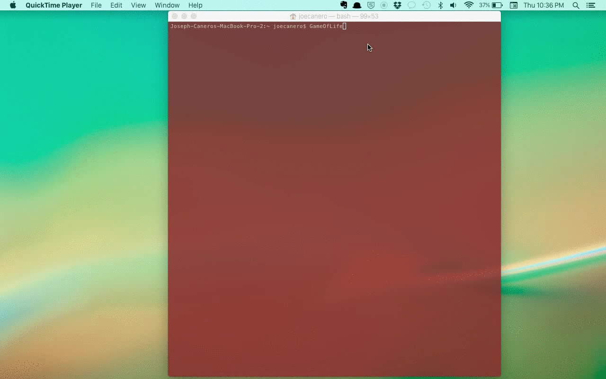

<h1>Game of Life</h1>
<p>My Conway's Game of Life implementation in Ruby.</p>


<p>When running the game via the terminal, it accepts two command-line arguments for window size.
If the arguments are not present, the window defaults to 480x480.</p>
```
ruby GameOfLife/ruby/game_of_life.rb 480 480
```
